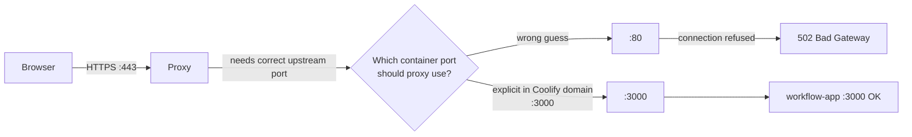

# Coolify Ports + Proxy Routing (Noob Map)

This project’s app listens on **port 3000 inside the container** (you can see it in logs as `0.0.0.0:3000`).

When you browse the site, your browser does **not** connect to the container directly. It connects to Coolify’s **proxy** (Traefik/Caddy), and the proxy forwards to the container.

## The 3 ports people confuse

- **Browser port (public)**: usually **443** for `https://...` (or 80 for `http://...`)
- **Proxy port (public)**: also **443/80** (Coolify’s proxy listens here)
- **Container/app port (private)**: **3000** (your Next.js server listens here)

## Flow chart: normal request path

```mermaid
flowchart LR
  U[Your Browser<br/>https://codespider.playdate.events] -->|HTTPS :443| P[Coolify Proxy<br/>Traefik / Caddy<br/>listens on :443]
  P -->|HTTP :3000 (internal Docker network)| A[workflow-app container<br/>Next.js server<br/>listens on :3000]
  A --> P
  P --> U
```

## Why a 502 happens

**502 Bad Gateway** means the proxy _could not connect to the upstream app_.

Typical reasons:

- Proxy tried the **wrong container port** (common default is `80`, but your app is on `3000`)
- Proxy and app are not on the same Docker network
- App crashed / not listening

## Your proof (what you already tested)

From the Coolify host, you tested:

- ✅ `http://<container>:3000/api/health` works
- ❌ `http://<container>:80/api/health` is refused

That strongly indicates the proxy was trying **port 80** instead of **3000**.

## What Coolify “domain:3000” means

When Coolify lets you set a domain like:

`https://codespider.playdate.events:3000`

it means:

> “When proxy receives requests for this domain, forward them to **port 3000 inside the container**.”

It does **NOT** mean your users should type `:3000` in their browser.

## Flow chart: how “domain:3000” fixes it



## What to set (recommended)

- **Coolify Domain**: `https://codespider.playdate.events:3000`
  - This tells the proxy to use container port **3000**
- **NEXTAUTH_URL**: `https://codespider.playdate.events`
  - No `:3000` here (this is what users see in the browser)

## Extra: what “ports:” vs “expose:” means (Docker Compose)

- **`expose: ['3000']`**

  - Makes port 3000 available to _other containers on the same Docker network_.
  - Good for proxy setups.
  - Not reachable from the public internet.

- **`ports: ['3000:3000']`**
  - Publishes port 3000 to the host machine (public/private depending on firewall).
  - Not needed when using Coolify’s proxy.
  - Coolify docs warn this can reduce features like rolling updates.

## MCP note

This project’s recommended setup is to use **remote MCP servers** (outbound HTTPS).
