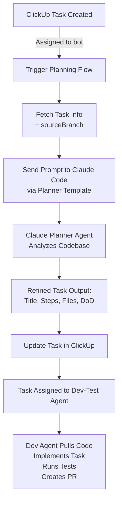

# n8n Workflow Integration

This guide covers how to integrate Workflow with n8n for automated task processing.

## Overview

The n8n integration allows you to create automated workflows that:

- Trigger on ClickUp task assignment changes
- Send tasks to Claude Code for planning or implementation
- Update tasks with results automatically

## Workflow Architecture



## Planner Flow Design

The planner flow automates task refinement before development begins.

### Flow Steps

1. **Trigger**: Assignee change on any task
2. **Fetch**: Get the task details
3. **Check**: Verify task was assigned to CodeSpider and is in "To Do" status
4. **Parse**: Extract task information:
   - Title
   - Description
   - Bug label (can be null)
5. **Template**: Use prompt template to complete the prompt
6. **Generate**: Create payload for API
7. **Send**: Send payload to Workflow API
8. **Receive**: Get response from Claude
9. **Update Task**:
   - Remove assignee
   - Leave comment with results
   - Update title, description, etc.

### Configuration Notes

| Setting      | Description                             |
| ------------ | --------------------------------------- |
| Workspace ID | Define in n8n global variables          |
| Bug Labels   | Configure label detection for bug tasks |
| API Endpoint | Your Workflow instance URL              |

## Setting Up the Integration

### Prerequisites

- n8n instance (self-hosted or cloud)
- ClickUp workspace with API access
- Workflow instance with API authentication configured

### Step 1: Configure ClickUp Trigger

Set up a ClickUp trigger node that watches for assignee changes on tasks.

### Step 2: Add HTTP Request Node

Configure an HTTP request to your Workflow API:

```
POST /api/ask
Authorization: Bearer YOUR_API_KEY
Content-Type: application/json
```

### Step 3: Parse Response

Use a Set node to extract the Claude response and format it for ClickUp.

### Step 4: Update ClickUp Task

Use the ClickUp node to update the task with the refined information.

## Next Steps

- See [Prompt Templates](/docs/prompt-templates) for the planner prompt format
- See [API Operations](/docs/api-operations) for API endpoint details
- See [API Authentication](/docs/api-authentication) for securing your integration
